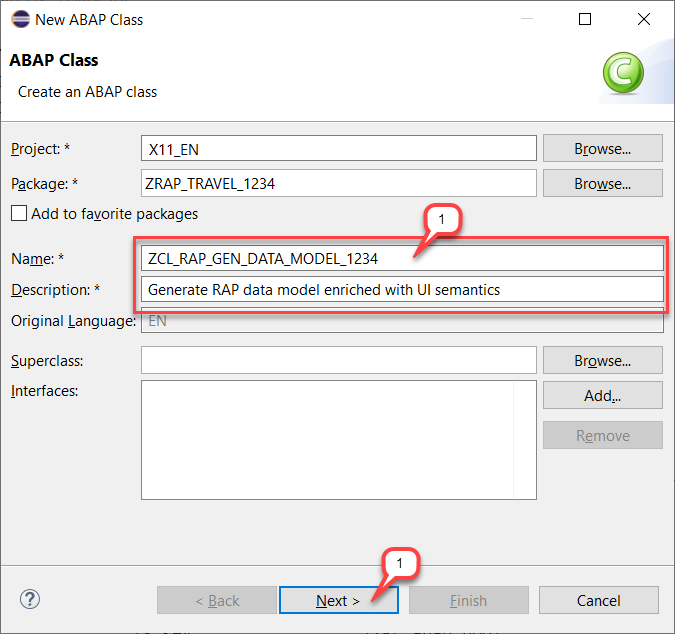
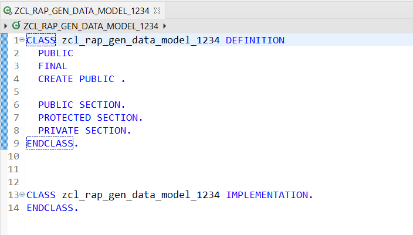
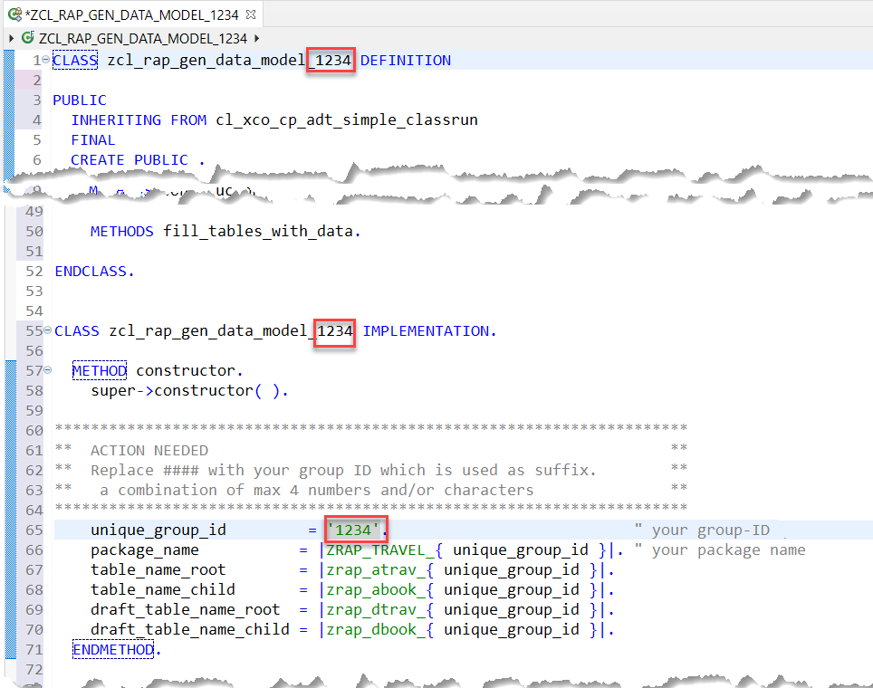
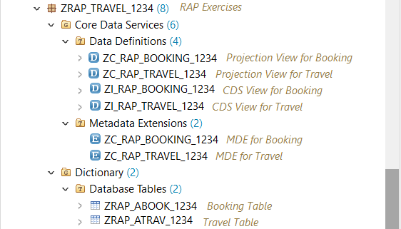
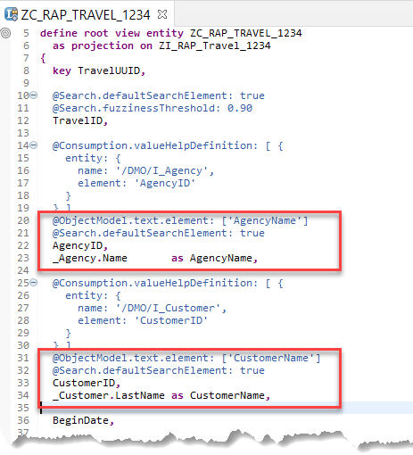
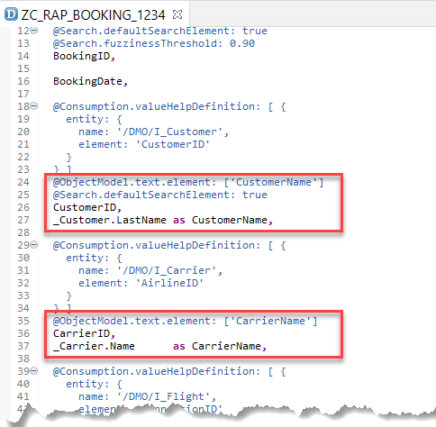

# Exercises 1-4 (Fast Track) - Generate Data Model  

## Introduction
The data model in this workshop consists of two transactional tables (**travel** and **booking**) as well as some master data that we will re-use from the already existing demo content (**Agency**, **Customer** and **Flight**), as well as a few more.   
A *Travel* entity defines general travel data, such as the agency ID or customer ID, the overall status of the travel and the price of travel.  
A *Booking* entity comprises general flight and booking data, the customer ID for whom the flight is booked as well as the travel ID to which the booking belongs to – and some admin fields.

You've already defined a group ID and created an ABAP package as described in the [Getting Started](/exercises/ex0/README.md) section.

In the current exercise you will create a helper class which will take care of the generation of the following RAP artefacts:
- **two database tables** (`ZRAP_A*`) to store the *travel* and *booking* data - both filled with some sample data 
- **two BO CDS views** (`ZRAP_I_*`) for the root entity *travel* and  child entity *booking* (CDS composition model)
- **two Projection CDS views** - aka Consumption views - (`ZRAP_C_*`) for the root entity *travel* and child entity *booking* (CDS data model projection) 
- **two CDS metadata extensions** (`ZRAP_C_*`) to enrich the projected root entity *travel* and projected child entity *booking* with UI semantics for the later rendering of the SAP Fiori Elements app (UI semantics).

## Exercise 1_4.1 - Generate the data model  
Create a helper class to generate the database tables and different CDS artefacts needed for the next exercises. The helper class will also fill some demo data into the database tables. For this purpose, demo data provided by the ABAP Flight Reference Scenario (main package: `/DMO/FLIGHT`) will be used.   
  
1. Right click on your package **ZRAP_TRAVEL_####** and choose **_New > ABAP Class_** from the context menu.      

   

2. Provide **`ZCL_RAP_GEN_DATA_MODEL_####`** (where `####` is your group ID) as name and a description (e.g. **_Generate RAP data model enriched with UI semantics_**) in the creation wizard for the new ABAP class and choose **Next**.

    

3. Assign a transport request and choose **Finish**. The new class is now created and the default content displayed in the editor.

    

4. Replace the complete source code of the class with the provided code snippet.  
   For that, delete the complete source code, insert the code snippet provided in the source code document **`ZCL_RAP GEN_DATA_MODEL_####`** linked below, and replace all occurrences of **`####`** with your group ID - i.e. your chosen suffix.
      
   > Hint: Open the document linked below in a separate windows to keep the exercise flow.
      
    **Source code document: [Class ZCL_RAP_GEN_DATA_MODEL_####](sources/EX14_1_CLAS_ZCL_RAP_GEN_DATA_MODEL.txt)**   
                
    The source code in the ADT editor should now look as follows:

         

5. Save  and activate  the changes.  
  
6. Press **F9** to run the ABAP class as a console application. As a result, you will see a success message in the Console.
   The various objects have been generated and activated.

      
   
7. Go to your package `ZRAP_TRAVEL_####` in the *Project Explorer* (where `####` is your group ID) and press **F5** to refresh the project explorer. It should now contain the generated objects.  
   You can preview the data from a database table or a CDS view by choosing the relevant objects in the *Project Explorer* and pressing **F8**.

   - Dictionary > Database Tables: `ZRAP_ATRAV_####` and `ZRAP_ABOOK_####`
   - Core Data Services > Data Definitions: `ZI_RAP_TRAVEL_####`, `ZI_RAP_BOOKING_####`, `ZC_RAP_TRAVEL_####` and `ZC_RAP_BOOKING_####`
   - Core Data Services > Metadata Extensions: `ZC_RAP_TRAVEL_####` and `ZC_RAP_BOOKING_####`
       

     
   
   You can preview the data of a database table or a CDS view in the Data Preview editor by selecting it and pressing **F8**. 
   Short explanations about the generated artefacts are provided below (where `####` is your group ID). 
      
8. **Database tables**    
    **`ZRAP_ATRAV_####`** is  used to store _Travel_ data. Its table key consists of the `client` field and the `travel_uuid` field which is a technical key (16 Byte UUID). It also contains a human-readable travel identifier `travel_id`. 

   **`ZRAP_ABOOK_####`** is used to store _Booking_ data. Its table key consists of the `client` field and the `booking_uuid` field which is a technical key (16 Byte UUID). It also comprises a human-readable booking identifier: `booking_id`.  
      
9. **CDS Data Model (Composition Model)**   
Both  CDS data definitions **`ZI_RAP_Travel_####`** and **`ZI_RAP_Booking_####`** (where `####` is your group ID) are CDS view entities used to define the *composition model* of our RAP BO. They are called *BO views* or *Interface views*, and typically beginn with the suffix `<namespace>I_` (e.g. `ZI_`) - following the naming convention of the SAP S/4HANA's Virtual Data Model (VDM).

   Our composition model consists of two nodes: The **root node travel** (`ZI_RAP_Travel_####`) and its **child node booking** (`ZI_RAP_Booking_####`). The root node (_Travel_) is explicitly defined by adding the keyword **`root`** to the define statement. Associations that define the composition model are explicitly defined using the keyword **`composition`**. Their corresponding on-condition is defined in the child entity.    
    
   In the child node (_Booking_), the corresponding **`to parent`** association is defined with the related on-condition.
     
10. **CDS Data Model Projection**   
    Both  CDS data definitions **`ZC_RAP_Travel_####`** and **`ZC_RAP_Booking_####`** (where `####` is your group ID) are CDS projection views used to define the use case or consumption specific CDS data model projection of our RAP BO. They are called *Consumption views* or *Projection views*, and typically beginn with the suffix `<namespace>C_` (e.g. `ZC_`) following the naming convention of the SAP S/4HANA's Virtual Data Model (VDM). They are defined on top of the interface views (`ZI_*`).

    The _Travel_ projection view exposes all the elements and _Booking_ composition defined in the underlying _Travel_ interface view - enhanced with additional metadata such as value Helps and searches.  However, the composition to the booking BO child node - i.e. the association **`_Booking`** - must be redirected to the Booking BO projection view. This is done using the **`redirected to composition child`** statement.
   
    In the _Booking_ projection view, the association to the _Travel_ BO parent node has been redirected to the _Travel_ BO projection view using the **`redirect to parent`** statement.

11. **CDS Metadata Extensions**   
Both  CDS metadata extensions **`ZC_RAP_Travel_####`** and **`ZC_RAP_Booking_####`** (where `####` is your group ID) are used to enrich respectively the *Travel* projection view and the *Booking* projection view with UI semantics for the later rendering of the SAP Fiori elements-based _Travel_ app - using UI-specific CDS annotations. The metadata extensions define e.g. the columns and fields shown on the list report page as well as on the object page in the SAP Fiori elements app.

## Exercise 1_4.2 - Adjust the CDS data model projection 
Due to some current restrictions in the helper class, some adjustments of the _Travel_ and _Booking_ projection views are required.

1. Open the *Travel* projection view **`ZC_RAP_Travel_####`** by double-clicking on it in the Project Explorer and adjust it as described next two steps. 
    
2. **Replace** the line  
   <pre> AgencyID, </pre>  
   with  
   <pre>
     @ObjectModel.text.element: ['AgencyName']
     @Search.defaultSearchElement: true
     AgencyID,
     _Agency.Name       as AgencyName,
   </pre>  
   
3. Also **replace** the line  
   <pre> CustomerID, </pre>  
   with  
   <pre>
     @ObjectModel.text.element: ['CustomerName']
     @Search.defaultSearchElement: true
     CustomerID,
     _Customer.LastName as CustomerName,
   </pre>  

   The changes should look as follows:   
       
     

4. Save  and activate  the changes.  
You can preview (**F8**) the result of the changes in the Data Preview editor. 

5.  Now open the _Booking_ projection view **`ZC_RAP_Booking_####`** by double-clicking on it in the Project Explorer and adjust it as described in the next two steps.

6. **Replace** the line  
    <pre> CustomerID, </pre>  
    
    with  
    
    <pre>
      @ObjectModel.text.element: ['CustomerName']
      @Search.defaultSearchElement: true
      CustomerID,
      _Customer.LastName as CustomerName,
    </pre>  
  
 7. Also **replace** the line  
     <pre> CarrierID, </pre>  
     
     with  
     
     <pre>
       @ObjectModel.text.element: ['CarrierName']
       CarrierID,
       _Carrier.Name      as CarrierName,
   </pre> 
   
   The changes should look as follows:    
       
     

8. Save  and activate  the changes.  
You can preview (**F8**) its data in the Data Preview editor. 

## Summary

Now that you've... 
- created the enriched data model: database tables, interface views, projections view and metadata extensions
- filled the database tables with sample data,
- and adjusted the projections views and the metadata extensions

You can continue with - [Exercise 5 - Business Service](../ex5/README.md)

## Appendix
Find the source code for the CDS views in the [sources](sources) folder. Don't forget to replace the placeholder `####` with your group ID.

Find the source code for the database tables and the helper class in the [sources](sources) folder. Don't forget to replace the placeholder `####` with your group ID or chosen suffix. 

- [Class ZCL_RAP_GEN_DATA_MODEL_####](sources/EX14_1_CLAS_ZCL_RAP_GEN_DATA_MODEL.txt)
- [Projection View ZC_RAP_TRAVEL_####](sources/EX14_2_DDLS_ZC_RAP_TRAVEL.txt)
- [Projection View ZC_RAP_TRAVEL_####](sources/EX14_3_DDLS_ZC_RAP_BOOKING.txt)
